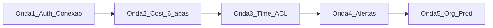

# Roadmap — snow_portal

| Onda | Status | Entrega |
| --- | --- | --- |
| **1 — Fundação + conexão** | Feita | React + FastAPI + Postgres, login portal, Browser OAuth/PAT, conexões, shell Cost |
| **2 — Cost Management completo** | Em curso | Editar/Inativar conexão; sessão WH/role; refresh OAuth; **6 abas** Cost; aceite “ver créditos” |
| **3 — Time de suporte (≥20)** | Planejada | Onboarding usuários/times, ACL por conexão, auditoria básica, UX multi-conta |
| **4 — Operação / FinOps ativo** | Planejada | Alertas (e-mail/webhook), ações controladas, snapshots locais |
| **5 — Org & produção** | Planejada | Org-connection first-class, hardening, deploy não-local, higiene repo |

