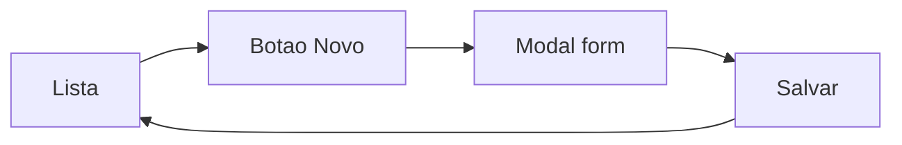

# Administração — handoff de UX

## Objetivo

Modernizar a tela **Administração** no mesmo shell visual do Alerts, com gestão de usuários e times e consulta dos dois papéis fixos do portal.

## Referência

- Mockup: [`html/admin.html`](admin.html)
- Visual base: [`html/alerts.html`](alerts.html) + [`html/ALERTS_UX_HANDOFF.md`](ALERTS_UX_HANDOFF.md)
- Página atual: `frontend/src/pages/AdminPage.tsx`
- APIs: `backend/routers/admin.py`

## Estrutura da tela

1. **Sidebar** — mesmo AppShell do Alerts; item **Administração** ativo (degradê suave + barra 2px); só `Time: Suporte`. Hover/foco/clique abre flyout com **Administração** e **Canais** (→ `channels.html`).
2. **Header** — `Administração — Gerencie usuários, times e papéis do portal` + meta `N usuários · M times`.
3. **KPIs** (somente leitura): Usuários ativos, Admins, Suporte, Times.
4. **Painel Usuários** — largura total; tabela + **Buscar usuário…** + **Novo usuário**.
5. **Popup Novo usuário** — modal (username, senha, papel, time). CTA **Salvar usuário**.
6. **Linha Times + Papéis** — no desktop, dois painéis lado a lado (`grid` 2 colunas); abaixo de 860px, empilhados.
7. **Painel Times** — tabela Nome | Usuários + **Buscar time…** + **Novo time**. Sem label de contagem no header do painel.
8. **Popup Novo time** — modal com Nome do time. CTA **Salvar time**.
9. **Painel Papéis** — tabela Nome | Nível de acesso | Usuários | Status + **Buscar papel…**. Sem label “papéis fixos” no header; sem **Novo papel**.

Busca de times filtra pelo nome no cliente. Contagem de times no meta do header da página (`N times`) continua sendo o total cadastrado.

## Fluxo de usuário (criar)

O mesmo padrão vale para **usuário** e **time**.
- Abrir limpa o foco e foca o primeiro campo.
- Salvar com sucesso fecha o modal, atualiza KPIs/listas e mostra flash.
- Só um modal aberto por vez.

## Comportamento do mockup

- Busca filtra username, papel e time no cliente.
- Busca de papéis filtra nome, nível de acesso e status no cliente.
- Criar usuário / criar time atualizam a lista e os KPIs localmente.
- As contagens de Admins, Suporte e usuários por papel são derivadas da lista de usuários.
- `body.modal-open` trava scroll da página enquanto o popup está aberto.
- Uma rolagem da página; overview sticky no desktop.
- Cada painel tem rolagem interna própria: header do card (título, busca, botão Novo) fica fixo, só a área da tabela rola. Usuários reserva sempre a altura de 5 linhas (`min-height` = `max-height` = cabeçalho + 5 × linha ≈ 257px), então Times e Papéis ficam na mesma posição independente da quantidade de usuários; Times e Papéis usam `min(32vh, 280px)`. O cabeçalho da tabela é sticky dentro da área rolável.

## Papéis e permissões

Existem exatamente dois papéis fixos nesta etapa:

- `admin` — acesso total ao portal.
- `suporte` — somente leitura e consulta; não pode criar, editar ou excluir dados.

O modal **Novo usuário** oferece apenas `suporte` e `admin`, nessa ordem. `suporte` é o valor inicial por ser a opção de menor privilégio.

A UX não é uma fronteira de segurança. Ocultar ou desabilitar controles no frontend melhora a orientação do usuário, mas o backend deve bloquear todas as mutações para usuários com papel `suporte`.

Não existe criação, edição ou exclusão de papéis nesta etapa.

## APIs existentes (implantar sem inventar)

| Método | Endpoint | Auth | Uso |
| --- | --- | --- | --- |
| GET | `/api/users` | `require_admin` | listar |
| POST | `/api/users` | `require_admin` | `{username, password, role, team_id}` |
| GET | `/api/teams` | usuário logado | listar |
| POST | `/api/teams` | `require_admin` | `{name}` |

Papéis válidos no produto: `admin`, `suporte`.

> Antes da implantação, alinhar o contrato das APIs e a validação do backend com `admin` e `suporte`. O mockup não pressupõe mudanças já aplicadas fora de `html/`.

## Fora de escopo (não implementar ainda)

- Editar / excluir usuário
- Desativar / reativar usuário
- Reset de senha
- Editar / excluir time
- Criar / editar / excluir papel
- Matriz de permissões além do papel
- Paginação server-side

## Mapeamento para React

| Mockup | Destino sugerido |
| --- | --- |
| Shell / sidebar ativo | `AppShell.tsx` |
| Página | `AdminPage.tsx` |
| Modal Novo usuário | componente local (dialog) em `AdminPage` ou `components/Modal` |
| Tokens / cards / badges / table | `frontend/src/index.css` |
| KPIs | derivados de `users` / `teams` |
| Painel Papéis | lista fixa `admin` / `suporte`, com contagens derivadas de `users` |
| Busca | `useState` local |
| Forms | `createUser` / `createTeam` atuais; submit fecha o modal |

## Checklist visual vs Alerts

- [ ] Mesmos tokens `--bg/--panel/--accent/--border/--muted`
- [ ] IBM Plex Sans / Mono
- [ ] Cards `border-radius: 10px`, KPI com `border-top: 3px`
- [ ] Badges pill (role + ativo)
- [ ] Modal alinhado aos painéis (borda, radius, fundo panel)
- [ ] Botão primary accent **Novo usuário** / **Salvar usuário**
- [ ] Sidebar ativo = degradê + barra 2×18px
- [ ] Header título + `—` + lead na mesma linha
