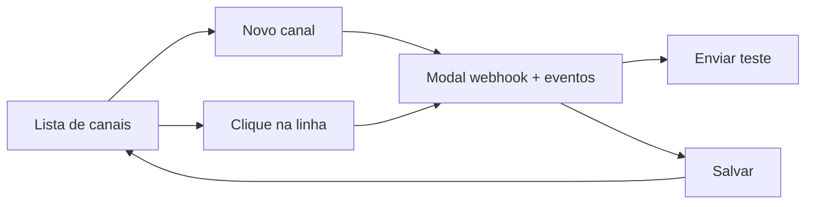

# Canais e comunicação — handoff de UX

## Ator(es)

- **Admin** — cria, edita, testa e pausa canais (Teams, Slack, Google Chat).
- **Suporte** — consulta canais e status em leitura; ações desabilitadas na UI (backend deve bloquear mutações).

## Objetivo da experiência

Centralizar a conexão de ferramentas de comunicação para receber alertas do Snow Portal, com clareza de provedor, eventos roteados e saúde da entrega.

## Referência

- Mockup: [`html/channels.html`](channels.html)
- Visual base: [`html/admin.html`](admin.html) + [`html/ADMIN_UX_HANDOFF.md`](ADMIN_UX_HANDOFF.md)
- Alerts (contexto de eventos): [`html/alerts.html`](alerts.html)

## Nome e navegação

| Elemento | Local | Prioridade |
| --- | --- | --- |
| Título da página | `Canais e comunicação` | primário |
| Item pai da sidebar | **Administração** (com chevron) | primário |
| Submenu (hover / foco / clique) | **Administração** · **Canais** | primário |
| Posição no menu | Subitem de **Administração** (não é item de topo) | — |
| Rota sugerida | `/canais` | — |
| Visibilidade | Preferencialmente `admin`; `suporte` só leitura | — |

### Comportamento do submenu

- Hover (desktop) ou foco no grupo **Administração** abre um flyout à direita com:
  1. **Administração** → `admin.html` / `/admin`
  2. **Canais** → `channels.html` / `/canais`
- Em mobile, o flyout abre abaixo do item (clique no trigger).
- Enquanto a página atual for Admin ou Canais, o pai **Administração** permanece no estado ativo (barra + degradê).
- No flyout, só o subitem da página atual recebe `aria-current="page"`.

> UX não é fronteira de segurança: ocultar/desabilitar botões orienta, o backend deve negar mutações.

## Jornada (passos)

1. Admin abre **Administração** → **Canais** (hover/clique no submenu) e vê KPIs + lista.
2. Clica **+ Novo canal** (ou **Conectar** / **Novo** no card do provedor).
3. Escolhe provedor, nome, webhook, eventos e time.
4. Opcional: **Enviar teste** (feedback flash + atualiza última entrega).
5. **Salvar canal** fecha o modal e atualiza lista/KPIs/provedores.
6. Clique na linha abre edição (webhook mascarado; campo vazio mantém o atual).

## Estrutura da tela

1. **Sidebar** — mesmo AppShell; item pai **Administração** ativo com flyout **Administração** / **Canais**; `Time: Suporte`.
2. **Header** — apenas `Canais e comunicação` (sem subtítulo).
3. **KPIs** (somente leitura):
   - Canais ativos (`is-ok`) — `N de M`
   - Provedores conectados (`is-attention`) — `N de 3`
   - Falhas em 24h (`is-alert`)
   - Eventos roteados hoje (`is-neutral`)
4. **Hairline** sob os KPIs (`.kpi-divider`).
5. **Painel Canais** — largura total; busca + filtro de provedor + **+ Novo canal**.
6. **Tabela** — Nome | Provedor | Destino | Eventos | Status | Última entrega; altura reservada ~5 linhas + scroll interno; clique edita.
7. **Split** (2 colunas ≥860px):
   - **Provedores** — Teams / Slack / Google Chat com badge Conectado / Não configurado, contagem e ações Conectar|Novo / Testar.
   - **Eventos** — catálogo somente leitura com contagem de canais inscritos.

## Provedores

| id | Label | Badge |
| --- | --- | --- |
| `teams` | Microsoft Teams | Incoming Webhook de canal |
| `slack` | Slack | Incoming Webhook de app |
| `gchat` | Google Chat | Webhook de espaço |

## Catálogo de eventos

- Crítico (≥90%)
- Alerta (70–89,9%)
- Monitor esgotado
- Orçamento excedido
- Conexão inativa

## Modal Novo / Editar canal

Campos:

- Provedor (select)
- Nome do canal
- Webhook URL (mono; dica muda com o provedor; na edição placeholder mascarado)
- Eventos (checkboxes do catálogo)
- Time responsável
- Canal ativo (checkbox)

Ações: **Cancelar** · **Enviar teste** · **Salvar canal**  
Um modal por vez; `Esc` e clique no backdrop fecham; `body.modal-open` trava scroll.

## Estados

| Estado | Comportamento / copy (pt-BR) |
| --- | --- |
| vazio | Nenhum canal configurado. Conecte Teams, Slack ou Google Chat para receber alertas. |
| busca sem resultado | Nenhum canal encontrado. |
| loading (teste) | Botão **Testando…**; preserva dados na lista |
| erro de teste | Falha ao enviar teste para {canal}. Verifique a URL do webhook. |
| sucesso teste | Mensagem de teste enviada para {canal}. |
| sucesso salvar | Canal {nome} criado. / Canal {nome} atualizado. |
| sem permissão | Somente administradores podem alterar canais. (ações desabilitadas) |

Status do canal na lista: **Ativo** · **Pausado** · **Falha** (badges com texto).

## Comportamento do mockup

- Busca + filtro de provedor combinados no cliente.
- Criar/editar atualiza lista, KPIs, Provedores e contagens de Eventos em memória.
- **Enviar teste** simula sucesso; falha se o nome contém “falha” ou a URL sugere erro.
- Flash verde/vermelho centralizado (`role="status"`).
- Overview sticky no desktop; no mobile volta ao fluxo natural.

## Componentes / padrões a reutilizar

- Tokens `--bg/--panel/--accent/--border/--muted/--ok/--warn`
- IBM Plex Sans / Mono
- `.kpi`, `.panel`, `.table`, `.badge`, `.search-pill`, `.modal-*`, `.flash`
- Sidebar ativo = degradê + barra 2×18px ([ALERTS_UX_HANDOFF](ALERTS_UX_HANDOFF.md))

## A11y mínima

- [x] labels / `.sr-only` em busca, filtro e campos
- [x] `aria-modal`, foco inicial e retorno ao fechar
- [x] `:focus-visible` com outline accent
- [x] badges com texto (não só cor)
- [x] flash com `aria-live="polite"`
- [x] linhas editáveis com `role="button"` + Enter/Espaço

## Fora do escopo UX deste item

- Implementação React / FastAPI
- OAuth de app Slack/Teams (somente webhook nesta etapa)
- Criptografia / vault do webhook
- Templates de mensagem, quiet hours, escalonamento
- Histórico completo de entregas / paginação server-side

## Dependências

- **requirements-analyst**: contrato de API de canais (CRUD + test delivery) quando for para produto
- **app-security**: quem pode ler/gravar webhooks; mascaramento em logs
- **web-app-developer**: portar mockup para rota `/canais` + AppShell após validação

## Mapeamento sugerido para React

| Mockup | Destino sugerido |
| --- | --- |
| Shell / submenu Administração → Canais | `AppShell.tsx` |
| Página | `ChannelsPage.tsx` (novo) |
| Rota | `/canais` em `App.tsx` (+ gate admin se aplicável) |
| Modal | dialog local na página |
| Tokens / cards / badges | `frontend/src/index.css` |
| Busca / filtro | `useState` local |

## Riscos de usabilidade

- Label longa **Canais e comunicação** no título da página; no submenu da sidebar usa **Canais** — manter consistência na implementação.
- **Canais** não compete no nível 1 do menu: vive sob **Administração** para reforçar que é configuração administrativa.
- Webhook é sensível: na edição, nunca pré-preencher o valor completo no input; só máscara no placeholder.
- Falha de entrega não deve ser confundida com “canal pausado” — badges distintos **Falha** vs **Pausado**.
